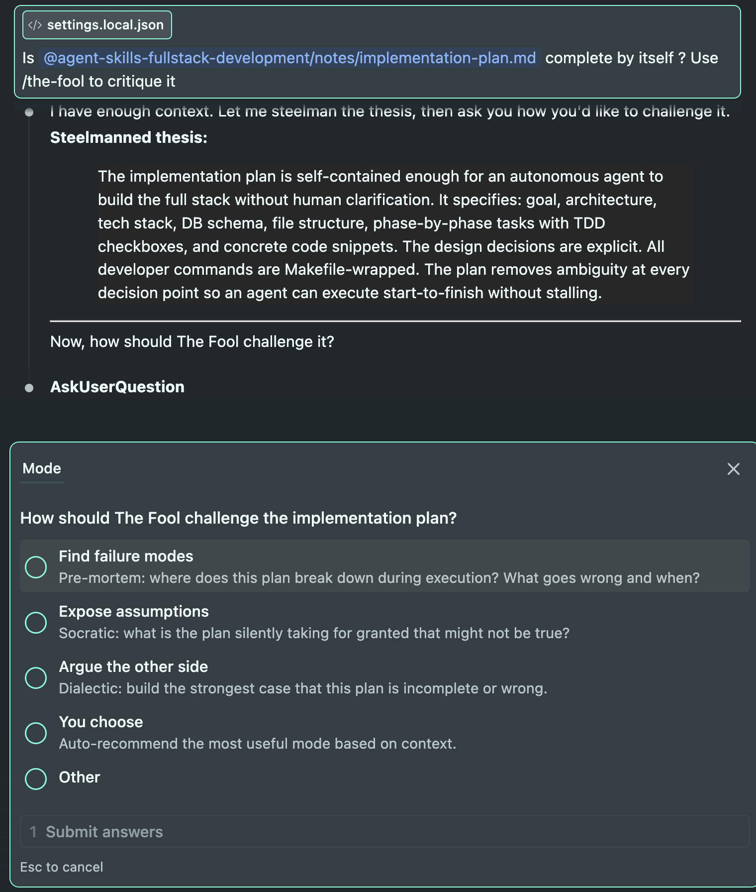

# agent-skills-fullstack-development

How to use agent skills for fullstack development: design, planning, development


## Running the frontend

```sh
make dev-frontend
```

Opens at `http://localhost:5173`. The root `/` redirects to `/demo`.

## Code editor agnostic setup

```sh
mkdir .claude
ln -sF .agents .claude
touch CLAUDE.md
ln -sF AGENTS.md CLAUDE.md
```

## Agents used

1. `the-fool`: Find logical loopholes in your design.
    <details>

    <summary>Screenshot</summary>

    
    </details>
2. `frontend-design`: UI designer, Define core UX colors, page styles, typography, color, overall coherence. Ideation
3. `design-taste-frontend`: UX engineer, CSS acceleration, technical implementation, forbidden patterns. Implementation
4. `coding-principles`: Implementation preferences
5. `writing-style`: Used to create documents.
6. `obra/superpowers`: for spinning up subagents, implementating details.
   1. subagents: Have 3 sub-agents prepare the code changes in parallel, that can then be written sequentially. Or, have 1 subagent investigate a technical question.
7. `mistake-memory-guidelines`: Create a list of mistakes AI has done, to avoid making them again.
8. `python-pro`: For backend development.
9. `react-expert`: For frontend development.
10. `fullstack-guardian`: When a task requires both changes together.
